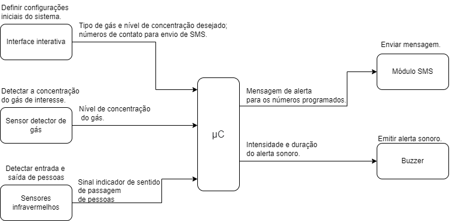
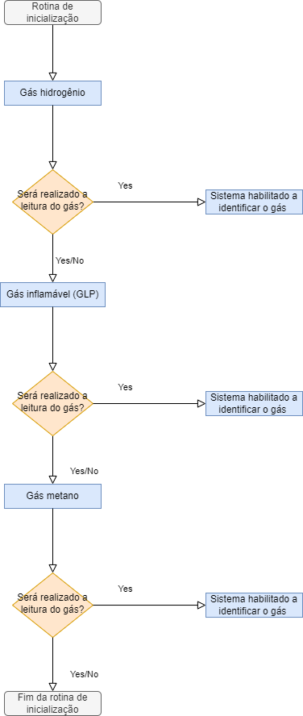
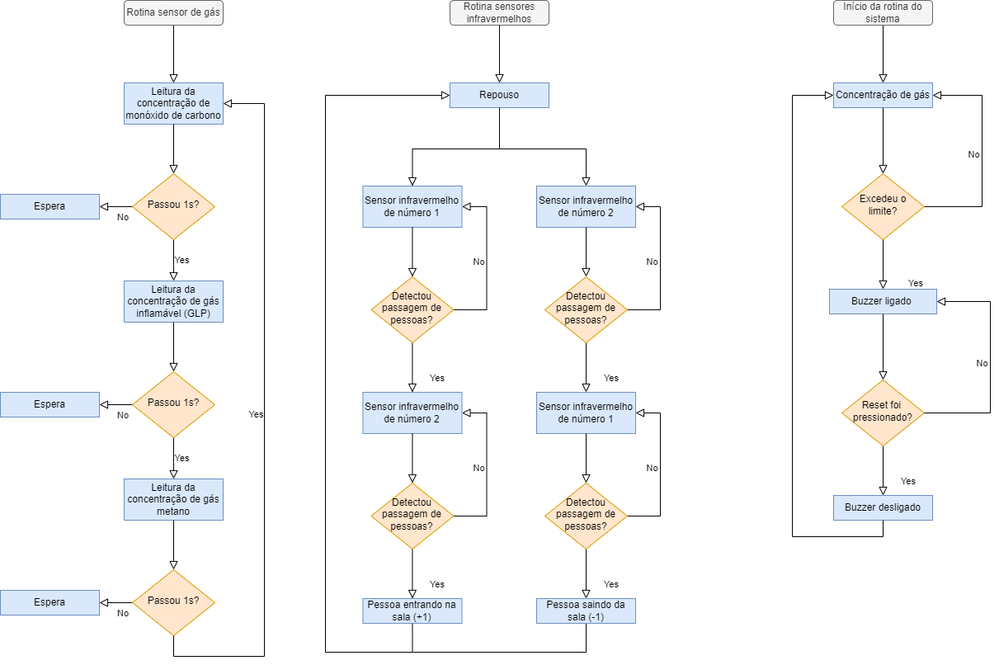
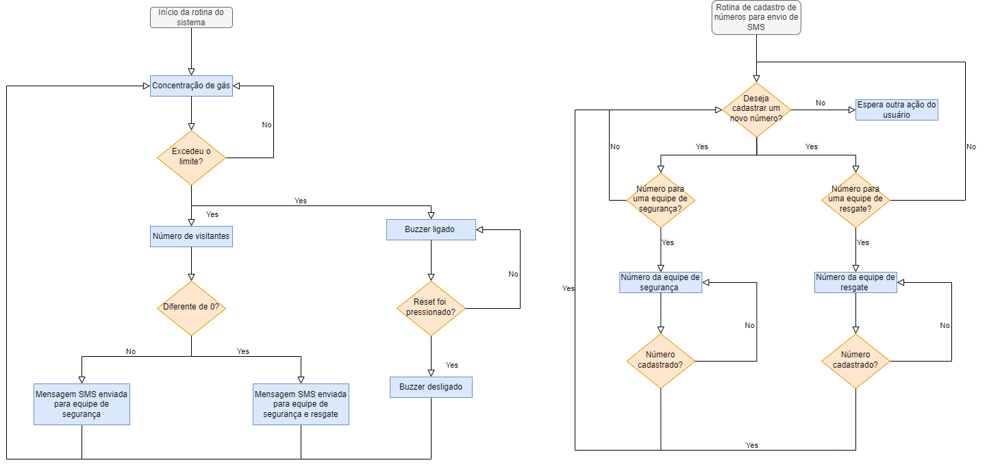
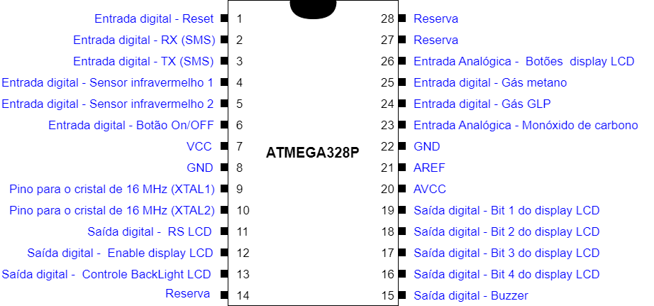

# `Sistema de Segurança para Vazamento de Gases`
# `Gas Leak Safety System`

## Apresentação

O presente projeto foi originado no contexto das atividades da disciplina de graduação *EA075 - Sistemas Embarcados*, 
oferecida no segundo semestre de 2022, na Unicamp, sob supervisão da Profa. Dra. Paula Dornhofer Paro Costa, do Departamento de Engenharia de Computação e Automação (DCA) da Faculdade de Engenharia Elétrica e de Computação (FEEC).

 |Nome  | RA | Curso|
 |--|--|--|
 | Matheus Pionório Calcanha  | 203556  | Eng. Elétrica|
 | Vitor Semenzato do Amaral  | 207054  | Eng. Elétrica|

## Arquivos Importantes

[Esquemático](https://github.com/vtrsa/ea075/blob/main/2022.2/Gas%20Leak%20Safety%20System/pdf/Esquematico-E3_Gas_Leak_Safety_System.pdf)

[Lista de componentes](https://github.com/vtrsa/ea075/blob/main/2022.2/Gas%20Leak%20Safety%20System/components.md)

[PCB -  Vista Superior](https://github.com/vtrsa/ea075/blob/main/2022.2/Gas%20Leak%20Safety%20System/images/3D_model_Top_View.png)

## Descrição do Projeto

O objetivo deste projeto é desenvolver um detector de gases versátil que consiga realizar a detecção de diferentes tipos de gases nocivos utilizando um mesmo dispositivo. O usuário poderá escolher o tipo de gás que o sistema irá ser responsável de reconhecer,sendo possível identificar até 3 gases diferentes simultaneamente, sendo eles o gás hidrogênio, o gás inflamável (GLP) e o gás metano. Além disso, ao identificar uma concentração de gás acima da especificada, um buzzer será acionado no local que só desligará após a falha ser reconhecida pelo usuário, caso a concentração ainda esteja superior ao permitido, o buzzer não desligará. Desejamos também, que no futuro o nosso dispositivo consiga enviar SMS para números pré-programados alertando sobre o local estar em condição de risco. A nossa maior motivação para desenvolver este projeto é trazer para o mercado um dispositivo que atenda diversas aplicações e instalações e consiga detectar diferentes tipos de gases. Iremos expandir a quantidade de gases que o dispositivo consegue detectar em protótipos futuros, o deixando cada vez mais versátil. Com isso, queremos solucionar o problema de se ter diferentes tipos de sensores numa instalação de diferentes fabricantes que acabam dificultando a integração aos sistemas de segurança.
O nosso produto visa atender principalmente indústrias e laboratórios químicos. Não temos um valor para nosso produto, porém, a ideia é que seu custo seja competitivo com o dos sensores de leituras específicas do mercado, de forma que como o nosso produto consegue ler diferentes tipos de gases, ele seja mais atrativo do que os demais sensores.

## Descrição Funcional

O nosso projeto tem a detecção de diferentes tipos de gases como a sua função principal, para isso, iremos utilizar um microcontrolador com memória embutida que será responsável por armazenar as informações enviadas por 2 sensores infravermelhos que irão indicar quantas pessoas estão no local em que o sensor de gás está instalado, conseguindo nos dizer quando uma pessoa entra/sai da instalação. Além dessa informação, o microcontrolador deverá receber um sinal digital informando se a concentração de gás excedeu o limite permitido ou então um sinal analógico que deverá ser tratado internamente verificando se o valor enviado pelo sensor excedeu o limite de concentração que foi configurado baseado nas normas de seguranças regentes no país em que o dispositivo foi instalado. Por meio do display LCD, o usuário ainda poderá escolher o tipo de gás que o sistema irá detectar baseado numa lista de opções que será mostrada no display e estará armazenada na memória interna do microcontrolador. 

Em aplicações futuras o usuário poderá configurar quais os números que deverão receber SMS em caso de detecção de concentração acima do limite permitido, essa configuração terá dois níveis de prioridade, o primeiro nível é o referente a equipe de segurança que será informada quando for indicado que a concentração de gás excedeu o limite independente se existem pessoas no local ou não. O segundo nível é o referente a equipe de resgate que será informada quando ocorre a condição citada anteriormente tendo pessoas na instalação. 

O primeiro protótipo ao detectar uma ocorrência de risco irá acionar um buzzer acoplado ao dispositivo por meio de uma saída digital que ficará emitindo som até que uma pessoa autorizada pressione o botão de reset após a concentração do gás normalizar novamente.

### Funcionalidades

- Configuração de quais gases o sistema irá ser responsável de realizar o monitoramento;
- Exibição das concentrações atuais dos gases no display LCD;
- Configuração dos números de telefone pelos quais o sistema ficará responsável de enviar SMS ao indentificar uma concentração de gás acima da especificada (Futuro); 
- Monitoramento dos níveis de concentração de determinados gases de interesse em um ambiente desejado;
- Registro do número de pessoas presentes em determinado local;
- Acionar indicador sonoro para alerta de perigo;
- Envio de mensagem SMS para números predeterminados (Futuro);
   
### Configurabilidade

Sendo o objetivo primário do sistema o monitoramento da concentração de gases potencialmente nocivos em um ambiente, o circuito terá margem para as seguintes configurações:

- Modelo do sensor de gás integrado ao sistema;
- Determinação do nível de concentração máxima do gás permitida no local;
- Determinação dos números de telefone para envio de SMS (Futuro).
- Determinação de quais gases o sistema irá ser responsável de realizar o monitoramento;
 
### Eventos

O sistema estará constantemente monitorando os níveis de concentração de determinado gás em um ambiente e a quantidade de pessoas presentes neste mesmo local. Desta forma, deverá realizar o tratamento dos seguintes eventos principais:

- Níveis de concentração abaixo do especificado sem pessoas na sala;

- Níveis de concentração abaixo do especificado com pessoas na sala;

- Níveis de concentração acima do especificado sem pessoas na sala;

- Níveis de concentração acima do especificado com pessoas na sala;

A leitura dos níveis de concentração é periódica, ocorrendo a cada segundo, enquanto a contagem de pessoas é um evento não-periódico, desta forma, os eventos que deverão ser tratados são periódicos, de frequência correspondente à da leitura dos níveis de concentração.

### Tratamento de Eventos

Ao detectar níveis de concentração abaixo do especificado independente de quantas pessoas estejam presentes, o sistema deverá apenas armazenar as informações coletadas pelos sensores, nenhuma ação será necessária;

Ao detectar níveis de concentração acima do especificado sem pessoas na sala, o sistema deverá emitir um alerta sonoro por meio do buzzer, indicando que o local em questão deve ser evitado, para o alerta sonoro ser desligado, é necessário pressionar o botão de reset do sistema. A pessoa que deverá realizar essa atividade, deve possuir treinamento e estar com os equipamento de proteção individual (EPI), pois caso a concentração ainda esteja elevada, o buzzer não será desligado;

## Descrição Estrutural do Sistema

O diagrama a seguir ilustra os blocos funcionais do sistema frente aos eventos que deverão ser tratados.

## Especificações

### Especificação Estrutural

**Sensores para detecção de gás**

Estes sensores, de modo geral, apresentam um material sensível ao gás que precisa ser detectado. Em contato com o ar puro sua condutividade elétrica é baixa enquanto na presença do gás desejado sua condutividade aumenta com a concentração. Desta forma, essa diferença de condutividade é explorada para obtenção de um sinal indicador da presença da substância desejada. 

Os sensores utilizados nesta aplicação serão o MQ-7, MQ-6 e MQ-4, responsáveis pela detecção de monóxido de carbono, gás inflamável (GLP) e gás metano, respectivamente. 

O sinal de saída de cada um destes componentes é analógico, entretanto, a conexão dos sensores MQ-7 e MQ-4 com o microcontrolador será feita via porta digital visto que estes componentes possuem módulos comerciais com conversão AD integrada. O sensor MQ-6 será conectado diretamente à porta analógica do microcontrolador. 

Os limites físicos dos sensores são listados em seus respectivos datasheets, mas de modo geral para operarem de maneira adequada deve-se evitar:

- exposição prolongada a ambientes adversos (umidade alta, temperaturas altas, alto índice de poluição…); 
- vibrações contínuas;
- contato com água;
- formação de gelo ou água condensada na superfície do sensor;
- tensão de alimentação acima da nominal.

**Sensor Infravermelho Reflexivo**

O sensor infravermelho que será implementado é o E18-D80NK-N. Este sensor com saída digital possui um emissor e um detector de sinal infravermelho. Caso haja algum objeto na frente deste dispositivo, o sinal infravermelho é refletido pela superfície do objeto e retorna ao detector, ocasionando um sinal de nível lógico baixo na saída, sendo assim, o sensor apresenta saída em nível baixo quando detecta algo e apresenta saída em nível alto quando não está sendo obstruído.

Este sensor opera com 5V e pode ser ajustado para detectar um objeto entre 6cm e 80cm. De acordo com o datasheet, este dispositivo pode apresentar ligeiras variações no range de detecção frente a cor e composição do objeto, assim, recomenda-se que seja feita a calibração antes do uso final.  

A conexão do sensor com o microcontrolador será feita via porta digital.

**Buzzer**

Caso um gás seja detectado acima do nível de concentração especificado um alerta sonoro será emitido por meio de um buzzer ativo de 5V conectado ao microcontrolador por meio de uma porta digital. A corrente necessária para suprir o buzzer será fornecida por meio de um transistor, evitando, assim, danos na porta do microcontrolador.

**Display LCD**

O shield contém um display alfanumérico de 2 linhas de 16 colunas, com backlight azul. Para a sua configuração, é necessário que se tenha 7 saídas do microcontrolador dedicadas ao display, sendo 4 para fazer com que o mesmo opera no modo 4 bits ( que oferece uma melhor resolução), 1 saída dedicada para controle do backlight do display, 1 saída para habilitar e desablitar o shield e 1 saída de RS (Data or Signal Display Selection). Além disso, a leitura dos botões é feita através de parâmetros analógicos. Os cinco botões do shield serão ligados à uma entrada analógica do microcontrolador através de resistores de valores diferentes. Portanto o botão pressionado pode ser determinado através da tensão medida pelo ADC, onde como cada botão estará associado a um resistor diferente, cada botão enviará um valor de tensão distinto para a entrada analógica.

No projeto, os botões serão usados para navegar pelo display,auxiliando o usuário a verificar a concentração dos gases em tempo rea. No futuro, também será possível usar o display para configurar números de telefone para envio de SMS.

**Microcontrolador**

Após listarmos todos os sinais que iremos precisar a partir dos sensores e atuadores citados acima. Devido a sua ampla utilização e disponibilidade no mercado foi adotado o microcontrolador ATMEGA328P para ser o responsável por tratar e gerenciar as rotinas do nosso dispositivo. O ATMEGA328P possui como características principais o fato de possuir 3 memórias internas, sendo elas uma memória Flash (32 KB), uma SRAM (2 KB) e uma EEPROM (1 KB), possui também 23 I/Os, opera com uma tensão de 5V e as suas saídas fornecem uma corrente de 40 mA, além disso, consegue operar com um clock entre 0 à 20 MHz.

### Especificação de Algoritmos

A seguir, será apresentado os fluxogramas que detalham o funcionamento do nosso dispositivo, o primeiro mostra em detalhe a rotina de inicialização do sistema, que é por meio dela que o usuário define quais gases ele quer que seja lido pelo sistema:

O fluxograma a seguir exemplifica o funcionamento normal do sistema, detalhando as rotinas de operação descritas nos tópicos acima:

Este, mostra como seria o sistema operando com o módulo SMS, mostrando as mudanças na rotina principal e que haveria uma rotina para cadastro dos números das equipes de segurança e resgate.

Partindo das especificações técnicas dos sensores e atuadores selecionados para o projeto e dos fluxogramas acima, definimos que os seguintes pinos do controlador ATMEGA328P que serão usados para o nosso projeto:

## Referências

https://cdn.sparkfun.com/datasheets/Sensors/Biometric/MQ-8%20Ver1.3%20-%20Manual.pdf  

https://www.filipeflop.com/produto/sensor-de-gas-mq-2-inflamavel-e-fumaca/  

https://www.filipeflop.com/img/files/download/Datasheet_Sensor_Gas_MQ2.pdf 

https://www.filipeflop.com/produto/sensor-de-gas-mq-4-metano/ 

https://www.filipeflop.com/img/files/download/Datasheet_Sensor_Gas_MQ4.pdf 

https://www.arducore.com.br/sensor-infravermelho-reflexivo-industrial-e18-d80nk 

https://datasheetspdf.com/pdf-file/1311838/ETT/E18-D80NK-N/1 

https://www.filipeflop.com/produto/buzzer-ativo-5v/ 

https://www.filipeflop.com/img/files/download/Datasheet_Sensor_Gas_MQ2.pdf

https://www.filipeflop.com/img/files/download/DOC_SIM900_Hardware%20Design_V2.00.pdf

https://www.filipeflop.com/img/files/download/SIM808_Hardware+Design_V1.00.pdf

https://www.filipeflop.com/produto/sensor-de-proximidade-infravermelho/

https://lastminuteengineers.com/sim800l-gsm-module-arduino-tutorial/

https://www.ti.com/microcontrollers-mcus-processors/microcontrollers/overview.html

https://www.st.com/en/microcontrollers-microprocessors

https://www.renesas.com/us/en/products/microcontrollers-microprocessors

https://www.microcontrollertips.com/key-factors-consider-choosing-microcontroller/

https://www.filipeflop.com/produto/display-lcd-shield-com-teclado-para-arduino/

https://datasheetspdf.com/pdf-file/746588/D-Robotics/DFR0009/1
