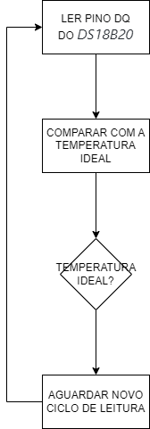

# `KeePet Comfort - Conforto Animal`
# `KeePet Comfort - Animal Comfort` 

## Apresentação

O presente projeto foi originado no contexto das atividades da disciplina de graduação *EA075 - Sistemas Embarcados*, 
oferecida no segundo semestre de 2022, na Unicamp, sob supervisão da Profa. Dra. Paula Dornhofer Paro Costa, do Departamento de Engenharia de Computação e Automação (DCA) da Faculdade de Engenharia Elétrica e de Computação (FEEC).

|Nome  | RA | Curso|
|--|--|--|
| Wesley Yoshitake Nakamatsu  | 188653  | Eng. Elétrica|
| Patric Moreto  | 223083  | Eng. Elétrica|

## Descrição do Projeto
Dada a rotina intensa de diversas famílias, a permanência no ambiente residencial está cada vez menor e, com isso, os animais de estimação são deixados sozinhos por longos períodos de tempo, de modo que suas necessidades em relação às condições do ambiente, como luminosidade e temperatura, não são observadas de modo a promover a saúde dos animais e impactanto negativamente o seu conforto diário.

Visando o bem-estar dos pets, busca-se, neste projeto, o desenvolvimento de um sistema embarcado que, de maneira autônoma, controle tanto a luminosidade de um quarto, com base no horário, buscando respeitar o ciclo biológico do animal, quanto a temperatura do ambiente, através de medições realizadas ao longo do dia.

## Descrição Funcional

### Funcionalidades
- Conexão à internet via wi-fi para verificação do horário e comunicação com atuadores;
- Medição de temperatura;
- Acender/apagar luzes via wi-fi conforme horário ;
- Ligar/desligar ar-condicionado/aquecedor via wi-ficonforme temperatura.

### Configurabilidade
O usuário poderá configurar via Interface Homem-Máquina (IHM) os seguintes parâmetros para a operação do circuito:
- Setpoint de temperatura;
- Horário em que as luzes devem ser acesas/apagadas.

### Eventos
- Tempetura ambiente igual a ideal;
- Tempetura ambiente abaixo da ideal;
- Tempetura ambiente acima da ideal;
- Hora para acender as luzes atingida;
- Hora para apagar as luzes atingida;
- Sincronização do horário do relógio;

Todos os eventos considerados são periódicos e diários, a temperatura ambiente deverá ser aferida em intervalos de meia hora e o acender/apagar das luzes deverá ser executado uma vez ao dia. Além disso, o relógio deverá ser sincronizado diariamente.

### Tratamento de Eventos
- **Tempetura ambiente igual a ideal:** aguarda o próximo aferimento de temperatura;
- **Tempetura ambiente abaixo da ideal:** aciona via wi-fi o aquecedor, passando o valor de setpoint determinado;
- **Tempetura ambiente acima da ideal:** aciona via wi-fi o ar-condicionado, passando o valor de setpoint determinado;
- **Hora para acender as luzes atingida:** acende via wi-fi as luzes do cômodo;
- **Hora para apagar as luzes atingida:** apaga via wi-fi as luzes do cômodo;
- **Sincronização do horário do relógio:** sincroniza o real-time clock (RTC) do circuito via wi-fi [[1]](#Referências).

## Descrição Estrutural do Sistema

## Especificações 

### Sensor de Temperatura

Com base no diagrama de blocos apresentado na seção [*Descrição Estrutural do Sistema*](#descrição-estrutural-do-sistema), identificou-se a necessidade de um sensor de temperatura como periférico de entrada. A partir dessa necessidade, foi feito o levantamento dos sensores que poderiam suprir a demanda do projeto, entre eles o *DS18B20*  [[4]](#Referências). O *DS18B20* é um termômetro digital que se comunica através do protocolo *1-Wire* [[5,6]](#Referências) que é utilizado para comunicações a baixas velocidades, 8.33 kbit/s no modo padrão, e tem a vantagem utilizar uma única linha, que é utilizada para alimentação e para realizar a transmissão de dados entre dispositivos. Para implementação da comunicação *1-Wire*, é necessário conectar um resistor, tipicamente de 4k7, entre a fonte de alimentação de +3,3V a +5,5V e o pino DQ. Para as condições ambientais requeridas, esse termômetro atende as necessidades de forma satisfatória, pois seu range de operação é de -55°C a +125°C, permitindo medir a temperatura ambiente de diferentes localidades. Além disso, para a faixa de -10°C a +85°C a precisão do periférico é de ±0.5°C, atendendo o propósito do projeto que não requer controle fino da temperatura. Como o DS18B20 é um termômetro digital, sua resolução pode ser configurada como 9, 10, 11, ou 12 bits, que corresponde a incrementos de 0.5°C, 0.25°C, 0.125°C e 0.0625°C, respectivamente.

### Módulo de Comunicação

Ainda com base na seção [*Descrição Estrutural do Sistema*](#descrição-estrutural-do-sistema), para a implementação do sistema embarcado há a necessidade de comunicação com a internet. Ao buscar módulos de comunicação, o módulo Wi-Fi ATWINC1500-MR210PA [[7]](#Referências) surgiu como uma alternativa viável, pois o seu range de temperatura de operação é de -40°C a +85°C, que pode ser utilizado em aplicações no intervalo em que a precisão do *DS18B20* é conhecida. Além disso, ele é compatível com as interfaces SPI, UART, e I2C.

### Real-Time-Clock (RTC)

Com base no [fluxograma elaborado](#descrição-estrutural-do-sistema) e no [tratamento de eventos](#tratamento-de-eventos), nota-se que, para o controle das luzes, é necessário que a hora seja conhecida. Dessa forma, identificou-se a necessidade de um módulo RTC que permite o controle do tempo. Um dos RTCs analisados foi o *DS1307* [[8]](#Referências) que permite contar horas, minutos, segundos, que atende a aplicação desejada. O *DS1307* comunica-se com o microcontrolador por meio da interface serial I2C. Para aplicações comerciais, seu range de temperatura é de 0°C a +70°C, que também satisfaz o intervalo de operação do *DS18B20*.

### Microcontrolador

### Discussão

O Módulo de Comunicação já está presente nos microcontroladores selecionados....

## Referências
[1] https://ntp.br/ - Acessado em 18 set. 2022.

[2] https://ww1.microchip.com/downloads/en/Appnotes/00929a.pdf - Acessado em 18 set. 2022.

[3] https://idc-online.com/technical_references/pdfs/electronic_engineering/Design%20of%20An%20Embedded%20System%20For%20Monitoring%20and%20Controlling%20Temperature%20and%20Light.pdf - Acessado em 18 set. 2022.

[4] https://datasheets.maximintegrated.com/en/ds/DS18B20.pdf - Acessado em 17 nov. 2022.

[5] https://www.ti.com/lit/an/spma057d/spma057d.pdf?ts=1666904477627&ref_url=https%253A%252F%252Fwww.google.com%252F - Acessado em 27 nov. 2022.

[6] https://pdfserv.maximintegrated.com/en/an/Overview_1wire_Technology_use.pdf - Acessado em 27 nov. 2022.

[7] https://ww1.microchip.com/downloads/en/devicedoc/atmel-42376-smartconnect-winc1500-mr210pa_datasheet.pdf - Acessado em 17 nov. 2022.

[8] https://datasheets.maximintegrated.com/en/ds/DS1307.pdf - Acessado em 17 nov. 2022.

