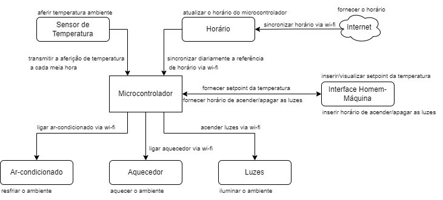
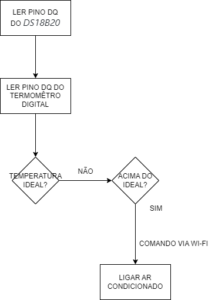
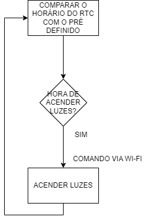
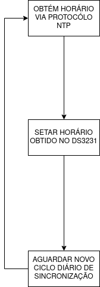

# `KeePet Comfort - Conforto Animal`
# `KeePet Comfort - Animal Comfort` 

## Apresentação

O presente projeto foi originado no contexto das atividades da disciplina de graduação *EA075 - Sistemas Embarcados*, 
oferecida no segundo semestre de 2022, na Unicamp, sob supervisão da Profa. Dra. Paula Dornhofer Paro Costa, do Departamento de Engenharia de Computação e Automação (DCA) da Faculdade de Engenharia Elétrica e de Computação (FEEC).

|Nome  | RA | Curso|
|--|--|--|
| Wesley Yoshitake Nakamatsu  | 188653  | Eng. Elétrica|
| Patric Moreto  | 223083  | Eng. Elétrica|

## Arquivos Importantes

[Esquemático em PDF]()

[Lista de Componentes](https://github.com/PatricMT/ea075/blob/main/2022.2/KeePet_Comfort/components.md)

[PCB]()

## Descrição do Projeto
Dada a rotina intensa de diversas famílias, a permanência no ambiente residencial está cada vez menor e, com isso, os animais de estimação são deixados sozinhos por longos períodos de tempo, de modo que suas necessidades em relação às condições do ambiente, como luminosidade e temperatura, não são observadas de modo a promover a saúde dos animais e impactanto negativamente o seu conforto diário.

Visando o bem-estar dos pets, busca-se, neste projeto, o desenvolvimento de um sistema embarcado que, de maneira autônoma, controle tanto a luminosidade de um quarto, com base no horário, buscando respeitar o ciclo biológico do animal, quanto a temperatura do ambiente, através de medições realizadas ao longo do dia.

## Descrição Funcional

### Funcionalidades
- Conexão à internet via Wi-Fi para verificação do horário e comunicação com atuadores;
- Medição de temperatura;
- Acender/apagar luzes via Wi-Fi conforme horário ;
- Ligar/desligar ar-condicionado/aquecedor via Wi-Fi conforme temperatura.

### Configurabilidade
O usuário poderá configurar via Wi-Fi os seguintes parâmetros para a operação do circuito:
- Setpoint de temperatura;
- Horário em que as luzes devem ser acesas/apagadas.

### Eventos
- Tempetura ambiente igual a ideal;
- Tempetura ambiente abaixo da ideal;
- Tempetura ambiente acima da ideal;
- Hora para acender as luzes atingida;
- Hora para apagar as luzes atingida;
- Sincronização do horário do relógio;

Todos os eventos considerados são periódicos e diários, a temperatura ambiente deverá ser aferida em intervalos de meia hora e o acender/apagar das luzes deverá ser executado uma vez ao dia. Além disso, o relógio deverá ser sincronizado diariamente.

### Tratamento de Eventos
- **Tempetura ambiente igual a ideal:** aguarda o próximo aferimento de temperatura;
- **Tempetura ambiente abaixo da ideal:** aciona via Wi-Fi o aquecedor;
- **Tempetura ambiente acima da ideal:** aciona via Wi-Fi o ar-condicionado;
- **Hora para acender as luzes atingida:** acende via Wi-Fi as luzes do cômodo;
- **Hora para apagar as luzes atingida:** apaga via Wi-Fi as luzes do cômodo;
- **Sincronização do horário do relógio:** sincroniza o real-time clock (RTC) do circuito via Wi-Fi [[1]](#Referências).

## Descrição Estrutural do Sistema

## Especificações 

### Sensor de Temperatura

Com base no diagrama de blocos apresentado na seção [*Descrição Estrutural do Sistema*](#descrição-estrutural-do-sistema), identificou-se a necessidade de um sensor de temperatura como periférico de entrada. A partir dessa necessidade, foi feito o levantamento dos sensores que poderiam suprir a demanda do projeto, entre eles o *DS18B20*  [[4]](#Referências). O DS18B20 é um termômetro digital que se comunica através do protocolo *1-Wire* [[5,6]](#Referências) que é utilizado para comunicações a baixas velocidades, 8.33 kbit/s no modo padrão, e tem a vantagem de utilizar uma única linha, que é empregada para alimentação e para realizar a transmissão de dados entre dispositivos. Para implementação da comunicação 1-Wire, é necessário conectar um resistor, tipicamente de 4k7, entre a fonte de alimentação de +3,3V a +5,5V e o pino DQ. Para as condições ambientais requeridas, esse termômetro atende as necessidades de forma satisfatória, pois seu range de operação é de -55°C a +125°C, permitindo medir a temperatura ambiente de diferentes localidades. Além disso, para a faixa de -10°C a +85°C a precisão do periférico é de ±0.5°C, atendendo o propósito do projeto que não requer controle fino da temperatura. Como o DS18B20 é um termômetro digital, sua resolução pode ser configurada como 9, 10, 11, ou 12 bits, que corresponde a incrementos de 0.5°C, 0.25°C, 0.125°C e 0.0625°C, respectivamente.

### Módulo de Comunicação

Ainda com base na seção [*Descrição Estrutural do Sistema*](#descrição-estrutural-do-sistema), para a implementação do sistema embarcado há a necessidade de comunicação com a internet. Ao buscar módulos de comunicação, o módulo Wi-Fi ATWINC1500-MR210PA [[7]](#Referências) surgiu como uma alternativa viável, pois o seu range de temperatura de operação é de -40°C a +85°C, que pode ser utilizado em aplicações no intervalo em que a precisão do DS18B20 é conhecida. Além disso, ele é compatível com as interfaces SPI, UART e I2C.

Em conformidade com a seção [*Discussão*](#discussão), foi optada pela não utilização de um módulo de comunicação externo, visto que o microcontrolador escolhido, o *ESP8285H16*, possui módulo Wi-Fi interno, simplificando o projeto.

### Real-Time-Clock (RTC)

Com base no [fluxograma elaborado](#descrição-estrutural-do-sistema) e no [tratamento de eventos](#tratamento-de-eventos), nota-se que, para o controle das luzes, é necessário que a hora seja conhecida. Dessa forma, identificou-se a necessidade de um módulo RTC que permite o controle do tempo. Um dos RTCs analisados foi o *DS3231* [[8]](#Referências) que permite contar horas, minutos, segundos, atendendo a aplicação desejada. O DS3231 comunica-se com o microcontrolador por meio da interface serial I2C, exigindo o uso de 2 pinos para alimentação de 3,3V e 2 pinos para o protocólo I2C. Para aplicações comerciais, seu range de temperatura é de 0°C a +70°C, que também satisfaz o intervalo de operação do DS18B20.

### Interface Homem-Máquina

Conforme a seção [*Discussão*](#discussão), foi optada pela não utilização de uma interface IHM, por conta da falta de pinos disponíveis no microcontrolador.

### Microcontrolador

Conforme definido na seção [*Descrição Estrutural do Sistema*](#descrição-estrutural-do-sistema), definiu-se que a utilização de um microcontrolador é fundamental para coordenar a leitura de periféricos de entrada e a subsequente tomada de decisões, visando o tratamento de eventos. Assim, com base nas necessidades abordadas pelas seções anteriores, foi escolhido o *ESP8285H16* [[10]](#Referências), capaz de realizar comunicação através de protocólos I2C e 1-Wire, possui comunicação Wi-Fi integrada ao chip e suas portas GPIO operam em +3,3V. Exibe temperatura de operação entre –40 °C e 105 °C, também atendendo ao intervalo do DS18B20, indicando ser capaz de satisfazer as condições físicas e ambientais do projeto. 

Em concordante com o que será discutido na seção [*Especificação de Algoritmos*](#especidifação-de-algoritmos), o microcontrolador é capaz de armazenar os programas e dados considerando sua memória flash interna de 2 MB, além de sua memória SRAM utilizável de cerca de 75 kB. Também foi realizado um levantamento de números de portas necessárias considerando os periféricos já mencionados, na qual o DS18B20 necessita de duas portas de alimentação e uma GPIO, além do DS3231 necessitar de duas portas para alimentação e as duas portas I2C do chip (pinos 9 e 14).

### Antena

Em conformidade com as [aplicabilidades do projeto](#funcionalidades), é necessário a utilização da comunicação Wi-Fi para diferentes atividades. A [*Discussão*](#discussão) elucidará a escolha do microcontrolador com módulo interno para Wi-Fi. No entanto, suas capacidades Wi-Fi se limitam a interpretação e execução dos protocólos de comunicação envolvidos, sendo necessária uma antena externa para estabelecer a comunicação sem fio. Dessa forma, após pesquisas realizadas, foi escolhida a *AN9520* [[14]](#Referências), atuando na faixa de 2,4 GHz, compatível com o ESP8285H16, e, por ser uma antena cerâmica, exibe desempenho superior quando comparada com antenas PCB, segundo relatos de usuários. Posteriormente, optou-se por substituir a antena AN9520 pela *ANT5320* [[15]](#Referências), pois apresenta menores dimensões, permitindo a otimização do roteamento da placa. Além disso, a ANT5320 possuir melhor rendimento, possuindo maior ganho direcional, isto é, maior parte da potência está direcionada a sua frequência de operação, e menor perda de retorno, a potência refletida é menor, otimizando o funcionamento do circuito. 

### Roteamento da PCI

Após a esolha da antena, utilizou-se como refência as [considerações para o layout de antenas cerâmicas] (#Referências) para elaboração do roteamento. Com base nessas considerações, dispensou-se a necessidade de elaboração de um circuito de casamento de impedância, visto que considerou-se que a largura de banda necessária para implentação da comunicação via Wi-Fi não será prejudicada com a adoção dessa premissa. A largura da microstrip line para a frequência de projeto foi calculada utilizando a ferramenta disponível no *KiCad* a partir do fornecimento dos parâmetros da placa que será utilizada para a fabricação do circuito. Ainda na calculadora do *KiCad*, conclui-se a mesma largura da microstrip line poderia ser utilizada para o roteamento dos demais componentes, pois a máxima corrente presente no circuito está limitada a máxima corrente do ESP8285H16 que é de 80 mA, e os 0,35 mm implementados permitem a corrente máxima de 3,95 A. Essa escolha de manter a espessura da trilha para o roteamento foi feita para acelerrar o processo de fabricação da placa. 

### Discussão

Durante a fase de busca por microcontroladores, primeiro foi considerada a utilização do microcontrolador *PIC24FJ64GP205* [[11]](#Referências), visto que atendia os protocolos de comunicação utilizados. Entretanto, pesquisas posteriores levaram à conclusão de que a utilização de um *ESP8266EX* [[9]](#Referências) simplifcaria o projeto, dado que o componente em questão já aprenseta módulo de comunicação Wi-Fi interno, eliminando o possível uso de mais portas e periféricos. Ainda, enquanto era realizada a especificação de memória desejada, a troca do microcontrolador foi optada novamente, em decorrência da falta de memória flash interna do ESP8266EX. Por conta das grandes similaridades físicas, apenas com um acréscimo de memória flash interna para armazenamento dos algoritmos, foi escolhido o *ESP8285H16*.

Para a primeira entrega (E1), havia sido projetada a utilização de uma Interface Homem-Máquina (IHM) com a função de permitir configuração do setpoint de temperatura e horário em que as luzes devem ser acesas/apagadas. No entanto, após pesquisa e análise dos dispositivos encontrados no mercado, como o *ILI9341* [[13]](#Referências), definiu-se que esse tipo de componente exige a utilização de muitos pinos do chip, inclusive entrando em conflito com os pinos I2C sendo utilizados pelo RTC, e, portanto, sua utilização foi descartada. Em seu lugar, as informações de temperatura e horário serão enviadas ao microcontrolador via Wi-Fi, utilizado um **aplicativo de celular**.

Outra substituição de componentes ocorreu com o módulo RTC, devido ao nível de tensão do *DS1307* [[12]](#Referências), de 5V, ser incompatível com a alimentação e GPIOs do ESP8285H16, de 3,3V. Assim, foi escolhido o *DS3231*.

Por fim, para a terceira entrega (E3), após análise das ligações a serem realizadas entre o microcontrolador e periféricos, foi verificada a necessidade da utilização de uma antena para comunicação sem fio através do Wi-Fi.

## Especificação de Algoritmos

|  |
|:--:| 
| *Tratamento de eventos para tempetura ambiente igual a ideal, abaixo do ideal e acima do ideal* |

|  |
|:--:| 
| *Tratamento de eventos para acender luzes, apagar luzes ou não acender e não apagar luzes* |

|  |
|:--:| 
| *Tratamento de evento para sincronizar horário do relógio* |

De acordo com os algoritmos exibidos acima, serão utilizados principalmente dados de horário e temperatura, que ocupam poucas unidades de bytes da memória. Como são utilizados algoritmos simples, consistindo em comparações entre valores medidos e valores armazenados em memória, além do envio de instruções via Wi-Fi, estima-se que, ao todo, sejam realizadas algumas centenas de instruções, na qual cada instrução tem o tamanho de uma palavra de memória, do mesmo tamanho da palavra do processador de 32 bits. Dessa forma, estima-se que a memória SRAM utilizável de 75 kB, além da memória flash interna de 2 MB, sejam mais do que suficientes para a aplicação.

## Referências
[1] https://ntp.br/ - Acessado em 18 set. 2022.

[2] https://ww1.microchip.com/downloads/en/Appnotes/00929a.pdf - Acessado em 18 set. 2022.

[3] https://idc-online.com/technical_references/pdfs/electronic_engineering/Design%20of%20An%20Embedded%20System%20For%20Monitoring%20and%20Controlling%20Temperature%20and%20Light.pdf - Acessado em 18 set. 2022.

[4] https://datasheets.maximintegrated.com/en/ds/DS18B20.pdf - Acessado em 17 out. 2022.

[5] https://www.ti.com/lit/an/spma057d/spma057d.pdf?ts=1666904477627&ref_url=https%253A%252F%252Fwww.google.com%252F - Acessado em 27 out. 2022.

[6] https://pdfserv.maximintegrated.com/en/an/Overview_1wire_Technology_use.pdf - Acessado em 27 out. 2022.

[7] https://ww1.microchip.com/downloads/en/devicedoc/atmel-42376-smartconnect-winc1500-mr210pa_datasheet.pdf - Acessado em 17 out. 2022.

[8] https://datasheets.maximintegrated.com/en/ds/DS3231.pdf - Acessado em 28 out. 2022.

[9] https://www.espressif.com/sites/default/files/documentation/0a-esp8266ex_datasheet_en.pdf - Acessado em 28 out. 2022.

[10] https://www.espressif.com/sites/default/files/documentation/0a-esp8285_datasheet_en.pdf - Acessado em 29 out. 2022.

[11] https://br.mouser.com/datasheet/2/268/PIC24FJ64GP205_GU205_Family_Data_Sheet_DS30010221D-2933213.pdf - Acessado em 17 out. 2022.

[12] https://datasheets.maximintegrated.com/en/ds/DS1307.pdf - Acessado em 17. out. 2022.

[13] https://cdn-shop.adafruit.com/datasheets/ILI9341.pdf - Acessado em 28 out. 2022.

[14] https://files.seeedstudio.com/wiki/Wifi_Bee_v2.0/res/Antenna_Datasheet.pdf - Acessado em 25 nov. 2022.

[15] https://www.mouser.com/datasheet/2/447/datasheet_ant5320ll04r2455a_v1_1617827487-2902839.pdf - Acessado em 27 nov. 2022.

[16] https://www.johansontechnology.com/chip-antenna-layout-for-802-11-applications - Acessado em 27 nov. 2022.
