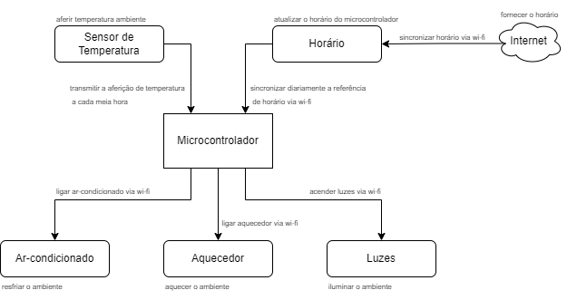

# `KeePet Comfort - Conforto Animal`
# `KeePet Comfort - Animal Comfort` 

## Apresentação

O presente projeto foi originado no contexto das atividades da disciplina de graduação *EA075 - Sistemas Embarcados*, 
oferecida no segundo semestre de 2022, na Unicamp, sob supervisão da Profa. Dra. Paula Dornhofer Paro Costa, do Departamento de Engenharia de Computação e Automação (DCA) da Faculdade de Engenharia Elétrica e de Computação (FEEC).

|Nome  | RA | Curso|
|--|--|--|
| Wesley Yoshitake Nakamatsu  | 188653  | Eng. Elétrica|
| Patric Moreto  | 223083  | Eng. Elétrica|

## Descrição do Projeto
Dada a rotina intensa de diversas famílias, a permanência no ambiente residencial está cada vez menor e, com isso, os animais de estimação são deixados sozinhos por longos períodos de tempo, de modo que suas necessidades em relação às condições do ambiente, como luminosidade e temperatura, não são observadas de modo a promover a saúde dos animais e impactanto negativamente o seu conforto diário.

Visando o bem-estar dos pets, busca-se, neste projeto, o desenvolvimento de um sistema embarcado que, de maneira autônoma, controle tanto a luminosidade de um quarto, com base no horário, buscando respeitar o ciclo biológico do animal, quanto a temperatura do ambiente, através de medições realizadas ao longo do dia.

## Descrição Funcional

### Funcionalidades
- Conexão à internet via wi-fi para verificação do horário e comunicação com atuadores;
- Medição de temperatura;
- Acender/apagar luzes via wi-fi conforme horário ;
- Ligar/desligar ar-condicionado/aquecedor via wi-ficonforme temperatura.

### Configurabilidade
O usuário poderá configurar via Interface Homem-Máquina (IHM) os seguintes parâmetros para a operação do circuito:
- Setpoint de temperatura;
- Horário em que as luzes devem ser acesas/apagadas.

### Eventos
- Tempetura ambiente igual a ideal;
- Tempetura ambiente abaixo da ideal;
- Tempetura ambiente acima da ideal;
- Hora para acender as luzes atingida;
- Hora para apagar as luzes atingida;
- Sincronização do horário do relógio;

Todos os eventos considerados são periódicos e diários, a temperatura ambiente deverá ser aferida em intervalos de meia hora e o acender/apagar das luzes deverá ser executado uma vez ao dia. Além disso, o relógio deverá ser sincronizado diariamente.

### Tratamento de Eventos
- **Tempetura ambiente igual a ideal:** aguarda o próximo aferimento de temperatura;
- **Tempetura ambiente abaixo da ideal:** aciona via wi-fi o aquecedor, passando o valor de setpoint determinado;
- **Tempetura ambiente acima da ideal:** aciona via wi-fi o ar-condicionado, passando o valor de setpoint determinado;
- **Hora para acender as luzes atingida:** acende via wi-fi as luzes do cômodo;
- **Hora para apagar as luzes atingida:** apaga via wi-fi as luzes do cômodo;
- **Sincronização do horário do relógio:** sincroniza o real-time clock (RTC) do circuito via wi-fi [[1]](#Referências).

## Descrição Estrutural do Sistema

## Referências
[1] https://ntp.br/ - Acessado em 18 set. 2022.

[2] https://ww1.microchip.com/downloads/en/Appnotes/00929a.pdf - Acessado em 18 set. 2022.
