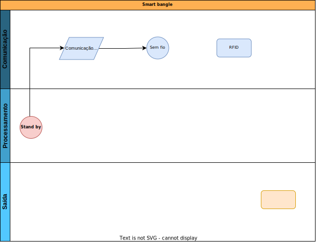

# `Pulseira Inteligente`
# `Smart Bangle`

## Apresentação

O presente projeto foi originado no contexto das atividades da disciplina de graduação *EA075 - Sistemas Embarcados*, 
oferecida no segundo semestre de 2022, na Unicamp, sob supervisão da Profa. Dra. Paula Dornhofer Paro Costa, do Departamento de Engenharia de Computação e Automação (DCA) da Faculdade de Engenharia Elétrica e de Computação (FEEC).

> Incluir nome RA e foco de especialização de cada membro do grupo. Os projetos devem ser desenvolvidos em duplas.
> |Nome  | RA | Curso|
> |--|--|--|
> | Rafael Cirino | 223730  | Eng. Elétrica|
> | Tarciso Hattum | 224622 | Eng. Elétrica|

## Descrição do Projeto
> Seja em lugares com muitas ou poucas pessoas é necessário que a empresa administradora do local possua controle sobre o acesso de público, monitore a sua permanência durante evento ou intereja com ele proporcionando a melhor experiência possível, criando assim uma lembrança afetiva entre a marca e o cliente.
>  
> Tendo em vista o que foi mencionado acima, o projeto tem como objetivos principais facilitar o controle e permitir uma maior interação com o público em grandes eventos, seja shows, parque de diversões/aquáticos, eventos esportivos etc. Além disso, pode ser utilizada para pequenas aplicações, por exemplo restaurantes, onde o seu uso seria indicado para registro de comanda e aviso de liberação de mesa.
> 
> O projeto em si, é uma pulseira que possui comunicação sem fio, um indentificador RFID, led, sistema vibra-call e é prova d' água. Abaixo, como exemplo, estão listados alguns cenários de uso:
> - Show
>   - Proporcionar uma experiência sensorial memorável ao público, onde todos estão com a pulseira e a partir de comandos enviados por uma central para elas, é possível sincornizar o acionamento dos leds, fazendo com que diferentes partes do público pisque em determinada cor e intensidade, criando um mosaico e um efeito luminoso.
> - Parque aquático e de diversões 
>   - Através do RFID é possível monitorar a entrada do público em brinquedos, bem como fornecer alertas na pulseira a partir de sinais enviados por uma central e proporcionar uma experiência coletiva entre os visitantes.
> - Restaurantes
>   - Em restaurantes, a smart bangle substitui os antigos pagers que avisam quando a mesa está liberada, além disso, ela pode ser utilizada na hora de resgitro da comanda. Atualmente em muitos estabelecimentos garçons utilizam tablet ou celular para registar os pedidos, só quem ainda é necessário que haja uma numeração das mesas, que cria um outro problema, dificuldade na criação de comandas separadas, a smart bangle resolve, pois com cada cliente usando uma pulseira, apartir da indentificação RFID, o garçon consegue encostar o tablet ou telefone nela e assim gerar o pedido para a comanda daquele clente em especifico. 

> Descrição do objetivo principal do projeto, incluindo contexto gerador, motivação.
> Escreva essa seção imaginando que está tentando convencer alguém a investir financeiramente no seu projeto.
> Qual problema vocês pretendem solucionar?
> Quem são os potenciais usuários?
> É possível estabelecer um valor econômico associado?

## Descrição Funcional
### Funcionalidades
> - **Comunicação sem fio**: responsável pela comunicação via rádio frequência entre a central e a pulseira com o auxílio de uma antena;
> - **Acionar LED**: atuador é acionado ao receber algum sinal de controle da central. Um exemplo seria num show onde a smart bangle receberia sinais de controle com o objetivo de sincronizar todas as pulseiras com certa cor e certa frequência;
> - **Vibrar**: atuador é acionado ao receber algum sinal de controle da central. Por exemplo, a smart bangle vibra com o intuito de avisar/alertar o usuário de algum evento próximo importante;
> - **RFID**: Fornecer uma indentificação única para a pulseira.
> - **Carregamento por indução**: com o auxílio de bobinas, o carregamento por indução é responsável por garantir que o produto esteja com uma bateria adequada pra uso e também por carregar simultanemanete diversos aparelhos;
> - **Prova d'agua**: pensado na aplicação de uso em parques aquáticos, a pulseira a prova d'agua garante maior durabilidade e necessita de forte isolamento;
> - **Bateria de longa duração**: uma bateria de longa duração é necessário para durar todo o evento.

### Configurabilidade
> - **Antena:** Sistema de entrada de dados via rádio frequência com banda de 142 a 1050 MHz
> - **Led RGB:** Sistema de sáida com três diodos emissores de luz em vermelho, verde e azul.
> - **Atuador vibra-call:** Sistema de sáida com nano atuador de vibra call
> - **Tag RFID:** Tag configurado com um id especifico para a smart bangle
> - **Bateria:** Aproximadamente 500 mAh, para durar cerca de 16h.
> - **Microcontrolador:** Com baixo consumo de energia, que permita interrupção, não é necessário grande capacidade de processamento e que permita codificar sinais de rede sem fio.
> - **Bobina para carregamento por indução:** Bobina de carregamento 5V que suporte pelo menos 1000mA de corrente
> - **Circuitos eletrônicos:** 
>	  - Capacitores;
>	  - Resistores;
>	  - Diodos;
>	  - Indutores;
>	  - Receptores;
>	  - Interfaces de entrada e saída;
>	  - Cristal de clock;
>	  - Regulador de tensão;
>	  - Decodificador;
>	  - Circuito de alimentação;
>	  - Icsp;

### Eventos
> | Evento  | Periodicidade | Prioridade |
> |--|--|--|
> |Sem fio | Média | Alta |;
> |Led | Média | Alta |;
> |Vibra-call | Baixa | Alta |;
> |Carregamento | Baixa | Média |;
> |Economia de energia | Baixa | Alta |;
> |Alerta/Aviso | Média | Alta |;
> |Festa | Média | Alta |;

### Tratamento de Eventos
> - **Stand by**: No modo espera somente o circuito de comunicação sem fio fica ativo, esperando algum comando externo para atuar.
> - **Sem fio**: Disparado quando há alguma comunicação externa, decodifica o sinal recebido e determina a ação neecessária.
> - **LED**: Ativação os leds com determinada frequência e cor.
> - **Atuador vibra-call**: Pulseira irá vibrar por um determinado período.
> - **Carregamento**: Quando algum sistema de indução é conectado, uma interrupção é gerada e a smart bangle entra no estado carregamento. .
> - **Economia de energia**: o bloco de processamento verifica se a smart bangle está com bateria baixa (bateria < 10%). Se sim, vai pro modo economia de energia, aciona um LED de estado (bateria baixa: led vermelho, carregando: led azul) e a conexão sem fio é cortada;
> - **Alerta/Aviso**: identifica a mensagem via conexão sem fio e se for necessário, gera um aviso, acionando vibra call e/ou o LED RGB;
> - **Festa**: identifica mensagem via conexão sem fio, entra no modo festa que faz o acionamento do LED com frequeências espeíficas.

## Descrição Estrutural do Sistema
> Junto com a descrição do comportamento do sistema, deve-se especificar, em nível de bloco ou sistema, a estrutura necessária 
> para captar os eventos do mundo externo, para alojar e processar o programa de tratamento de eventos, e para atuar sobre o mundo externo.
>
> Para essa descrição recomenda-se a criação de diagramas de blocos.
> Nesse diagrama, devem ser destacados os blocos funcionais que compõem o sistema, incluindo uma síntese das funcionalidades de cada bloco.
> Além disso, deve-se esclarecer também o relacionamento entre estes blocos, incluindo os principais sinais de comunicação entre
> os blocos de forma a assegurar a execução de todas as tarefas que o sistema deve realizar.
> 
> Você sabia? Ferramentas como o `draw.io` permitem integração com o Github.

## Referências
> - https://pvieito.com/2016/09/xyloband-reverse-engineering
> - https://www.instructables.com/Hacking-a-Xyloband-With-Arduino/
> - https://blog.hqcodeshop.fi/archives/395-Xyloband-Whats-inside-one.html
