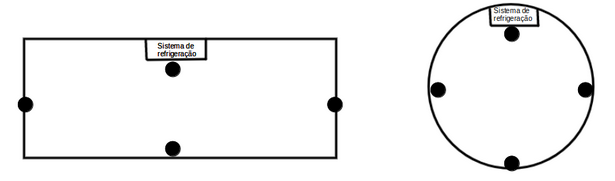

# `Controle de temperatura robusto`

# `Robust temperature control`

  

## Apresentação

  

O presente projeto foi originado no contexto das atividades da disciplina de graduação *EA075 - Sistemas Embarcados*,

oferecida no primeiro semestre de 2023, na Unicamp, sob supervisão da Profa. Dra. Paula Dornhofer Paro Costa, do Departamento de Engenharia de Computação e Automação (DCA) da Faculdade de Engenharia Elétrica e de Computação (FEEC).

  

> Incluir nome RA e foco de especialização de cada membro do grupo. Os projetos devem ser desenvolvidos em duplas.

> |Nome | RA | Curso|

> | Felipe dos Reis Lemos | 204069 | Eng. Elétrica|

> | João Paulo Christofolletti | 199681 | Eng. Elétrica|
>
  
  

## Descrição do Projeto

> O mal controle de temperatura pode interferir em diversos processos industriais, especialmente tratando-se de produtos sensíveis a alterações ambientais como os dos setores farmacêutico e alimentício. Logo, o controle dessa variável é fundamental para garantir que o padrão de qualidade seja atingido, pois a falta de controle sobre a temperatura do ambiente pode resultar em desperdício dos produtos, o que significa prejuízos financeiros. Há equipamentos que necessitam também atuar dentro da faixa de temperatura indicada pelos fabricantes, ou poderão apresentar defeitos.
>
> Diante disso, este projeto tem como objetivo realizar o controle de temperatura de um determinado ambiente de forma robusta utilizando a média ponderada de quatro sensores de temperaturas espalhados pelo ambiente e usando um controle PID. Pode-se ser desde um ambiente industrial, onde se encontra uma linha de produção que necessita de uma temperatura uniforme ao longo de todo o percurso, por exemplo, ou um ambiente residencial, o qual pode ser um cômodo ou a casa inteira. Portanto, é esperado uma maximização da eficiência energética e consequentemente o controle mais preciso e uniforme da temperatura do local escolhido pelo cliente, garantindo assim maior qualidade sobre seu produto.
>
> O público alvo são empresas ou pessoas específicas, as quais desejam uniformizar, maximizar e obter uma maior eficiência energética em relação a refrigeração presentes em suas residências, e empresas as quais necessitam garantir um controle preciso da temperatura em sua linha de produção, por exemplo, para que possam aumentar a qualidade e confiabilidade de seus produtos.
> 
> Um controle de temperatura por PID é uma tecnologia avançada que permite um controle preciso da temperatura em processos industriais. Isso pode resultar em economia de energia e aumento da eficiência do processo de controle. Além disso, é um tipo de controle amplamente utilizado nas mais diversas complexidades da indústria, não somente em processos simples.
> 
> O controle por PID tem a capacidade de ajustar a intensidade de resfriamento com alta precisão. Isso acontece porque eles levam em consideração a temperatura ideal a ser atingida. 
> 
> São sistemas que requerem controle preciso de temperatura. O controlador PID é amplamente utilizado em diversas áreas, como indústrias alimentícias, farmacêuticas, químicas, de plásticos, entre outras.
>
>O valor econômico pode ser calculado a partir da análise de indicadores de desempenho, como o tempo de produção, a maximização do consumo de energia, o consumo de matérias-primas. Dessa forma, é possível determinar o retorno sobre o investimento em um controlador PID de temperatura e compará-lo com outras alternativas de controle de temperatura.
>
## Descrição Funcional
>
### Funcionalidades
>
> As funcionalidades principais do projeto são:
>
> 1. Fazer a média ponderada dos quatros sensores de temperaturas, pois assim há uma garantia maior de que o ambiente está numa temperatura uniforme.
>
> 2. Com base no resultado da média da temperatura do ambiente, o sistema identifica se há necessidade ou não de atuar no sistema de refrigeração para manter a temperatura mais próxima da requerida pelo cliente.
>
> 3. Há uma interface com o usuário para que ele consiga estabelecer as temperaturas desejadas e, caso haja necessidade, pode resetar o sistema e iniciar novamente.
>
> 4. Comunicação com a rede para enviar os dados em tempo real para a nuvem, para o firebase, por exemplo. 
>
> 5. Indicação por leds de quando o sistema está ou não funcionando corretamente
>
> 6. Não exige uma curva de aprendizado grande do usuário, pois todo o sistema será intuitivo e de fácil entendimento e operação.
> 
### Configurabilidade
>
> Módulo de comunicação Wi-Fi
>
> A princípio o microcontrolador principal será o ATMEGA328P, porém ao longo do desenvolvimento pode ser que outro microcontrolador atenda melhor o objetivo do projeto
>
> Circuito para codificar as informações enviadas para a nuvem.
>
> Leds de sinalização, sendo um verde indicando que o sistema está operando corretamente, outro amarelo indicando que o sistema está pausado esperando o usuário iniciá-lo e um vermelho indicando que o sistema não está funcionando corretamente e precisa ser reiniciado.
>
> Sensor de temperatura: O controlador deve ser capaz de trabalhar com diferentes tipos de sensores de temperatura, como termopares e termistores.
>
> Saída de controle: O controlador deve ser capaz de fornecer a saída de controle adequada para o sistema, seja por meio de um sinal analógico, PWM (Modulação por Largura de Pulso) ou outro método.
>
 ### Eventos
>
> Medição periódica dos sensores de temperatura: como medição de forma discretizada da temperatura, por exemplo, em um período de 1s.
>
> Após, realizar os cálculos pelo controlador de qual o sinal de saída para o controle da temperatura no ambiente (periódico, acompanha a medição)
>
> Envios dos dados para o servidor (Firebase)
>
> Configuração (não-periódico) depende do usuário o acionamento, como a calibração automática ou manual dos dados, além da inserção do setpoint (temperatura alvo) do sistema de controle
>
> Exibição no display (periódico) dos dados, entra no loop do sistema e atualiza os valores, conforme cálculos
>
### Tratamento de Eventos
>
> Leitura de dados: ser capaz de ler e monitorar os dados de temperatura em tempo real, utilizando sensores e/ou termopares. Pois esses dados serão usados para o cálculo do controle do sistema.
>
> Cálculo do erro: O sistema deve ser capaz de calcular o erro entre a temperatura medida e a temperatura desejada, utilizando a lógica do controlador PID.
>
> Cálculo de controle: a ação de controle necessária para corrigir o erro e trazer a temperatura de volta ao valor desejado, utilizando a lógica do controlador PID. É nessa etapa que há o cálculo do controle em relação aos coeficientes do controlador kp, ki e kd.
>
> Acionamento de ações: acionar ações específicas de acordo com o tipo de evento, como por exemplo, acionar uma saída de controle para ajustar a temperatura, ou desligar algum dispositivo. O sinal de controle é o acionamento do sistema de resfriamento realizado por ventiladores, por meio de um fluxo de ar relativo ao cálculo do controlador, que é um sinal PWM.
>
> Registro de informações: registrar as informações relevantes de cada evento, como as leituras de temperatura, os valores do erro e do controle. Deve armazenar e enviar as informações para o usuário.
>
> Comunicação com os usuários: comunicar os eventos relevantes aos usuários, como alarmes de temperatura, para que eles possam tomar as medidas necessárias e acompanhar o status do processo, além de dados de configuração e informações em tempo real.
> 
>Calibração: realiza uma parametrização com o auxílio do usuário, para configuração do controlador de temperatura (kp, ki e kd), através de algum método de controle, por exemplo, métodos de Ziegler-Nichols
>  
## Descrição Estrutural do Sistema
> Atuadores:
> Sinal PWM para os ventiladores
> Acionamento da refrigeração: exaustor, condensador.
>
> Sensores:
> Sensores de temperatura: a quantidade colocada no ambiente
>
>Comunicação:
> Módulo WiFi para envio dos parâmetros para a nuvem
> Botões, display e LEDs para a comunicação com o usuário
>
>Controlador:
> Microcontrolador ATmega (a princípio) que realiza os cálculos

>
>
## Especificações

### Especificação Estrutural

> Para cumprir com os objetivos propostos e não tornar nosso projeto muito complexo e caro, decidimos por utilizar o microcontrolador ATmega328P, que é o mesmo utilizado no Arduino. Portanto já existe um grande acervo de materiais disponíveis para consulta e uma grande comunidade que utiliza esse microcontrolador, assim facilita o desenvolvimento deste projeto. 
>
> A distribuição dos quatro sensores de temperatura será feita de modo que a média deles tente representar muito bem o ambiente, ou seja, colocando um mais afastado do sistema de resfriamento do ambiente, outro perto e os outros dois na metade entre a parte mais distante do cômodo até o sistema de resfriamento. A figura abaixo mostra dois exemplos de ambientes e os pontos em preto representam exemplos de onde os sensores de temperaturas podem ser colocados.
>
> 
>
> Para poder medir a temperatura do ambiente escolhemos o termômetro digital DS18B20, pois ele não necessita de nenhum módulo adicional, ou seja, pode ser conectado dirematente nas entradas GPIO's do microcontrolador que iremos utilizar e é relativamente barato. Para que seja possível essa comunicação entre o sensor e o ATmega teremos que definir as entradas do microcontrolador e utilizaremos bibliotecas disponíves e vamos ter que definir os endereços de momória, uma vez que, pretendemos utilizar uma única porta para os quatros sensores.
> 
> Para mostrar as informações, iremos utilizar um display OLED 128x64, pois ele consegue mostrar diversar informações utilizando apenas duas portas de dados e seu custo é relativamente baixo. 
> 
> O módulo Wi-Fi será o ESP8266, o qual possui compatibilidade com o microcontrolador que estamos utilizando e há diversos materiais na internet de como realizar as configurações necessárias para poder utilizá-lo com o ATmega. Para poder conectá-lo, vamos ter que definir uma porta como TXD e outra como RXD para receber e enviar os dados via Wi-Fi
> 
> O acionamento do sistema de refrigeração será feito através de um sinal PWM de saída para os refrigerados
> 
> Vamos utilizar também um cristal oscilador de 16 MHz como clock 

### Especificação de Algoritmos 

>A especificação dos algoritmos é ilustrada em 3 fluxogramas:
>
#### Interface do usuário:
>
>- Tela de início e inicialização do sistema.
>
>- Menu de configuração exibindo opções como calibração e rede Wi-Fi.
>
>- Se houver uma interrupção via teclado/encoder, exibir opções de configuração.
>
>- Se nenhuma interrupção for identificada, o display continua mostrando os dados ao usuário.

> 
#### Modo Calibração:
>
>Início da calibração selecionando no menu.
>Opção para o usuário inserir os valores manualmente ou realizar um teste automático para o cálculo dos coeficientes.
>Atualização dos valores do controlador.

>

#### Funcionamento do controlador:
>
>- Realização das medições dos sensores do sistema em intervalos definidos.
>- Cálculos para ativação do controle e verificação de eventos necessários para manter a temperatura controlada dentro dos limites desejados.
>- Se não houver mudança no setpoint (diferença entre a temperatura de referência e a temperatura do sistema), apenas atualiza as variáveis do código.
>

## Referências
> -  SILVA, Italo. UTILIZAÇÃO DE UM CONTROLE PID DE TEMPERATURA PARA ESTUDO DE RESFRIAMENTO TERMOELÉTRICO. 2022. Monografia (Graduação em Engenharia Mecânica) - UFPE, [S. l.], 2022. Disponível em: https://repositorio.ufpe.br/bitstream/123456789/47590/1/TCC%20%C3%8Dtalo%20Souza%20da%20Silva.pdf. Acesso em: 2 abr. 2023.
>
> - PRATA, Tiago; CAMPO, Alexandre. Desenvolvimento e aplicação de controle preditivo baseado em modelo (MPC). Sociedade Brasileira de Automática, [S. l.], p. Vol 2 No 1, 8 dez. 2020. DOI https://doi.org/10.48011/asba.v2i1.1187. Disponível em: https://www.sba.org.br/open_journal_systems/index.php/cba/article/view/1187. Acesso em: 2 abr. 2023.
>
> - Datasheet do micocontrolador ATMEGA328P:https://www.ic-components.hk/files/cb/DEV-14083.pdf
>
> - Datasheet de termômetro: https://pdf1.alldatasheet.com/datasheet-pdf/view/58557/DALLAS/DS18B20.html
> 
> - Link do display: https://nurdspace.nl/images/e/e0/ESP8266_Specifications_English.pdf

