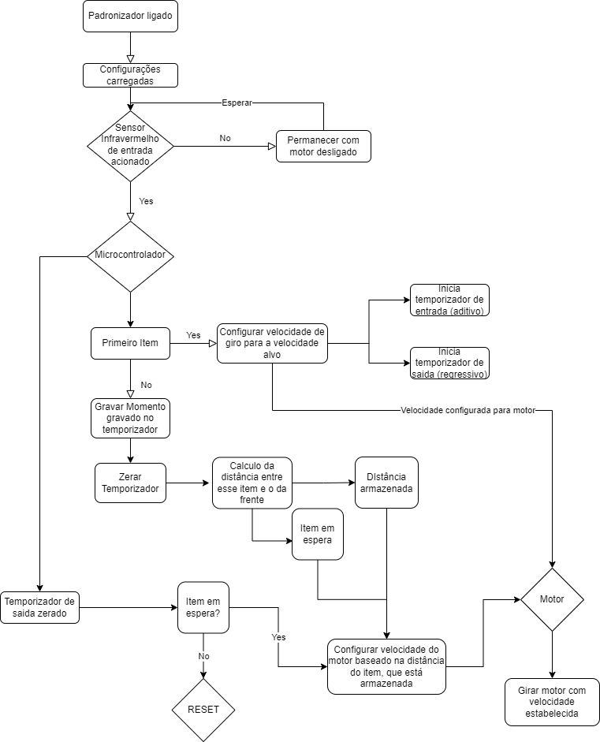

# `Padronizador Variável de Linha de Produção`
# `Variable Line Production Standardizer`

## Apresentação

O presente projeto foi originado no contexto das atividades da disciplina de graduação *EA075 - Sistemas Embarcados*, 
oferecida no segundo semestre de 2022, na Unicamp, sob supervisão da Profa. Dra. Paula Dornhofer Paro Costa, do Departamento de Engenharia de Computação e Automação (DCA) da Faculdade de Engenharia Elétrica e de Computação (FEEC).

|Nome  | RA | Curso|
|--|--|--|
| Marcelo Montandon Magalhães  | 259118  | Eng. Elétrica|
| Victor Mario Bertini  | 194761  | Eng. Elétrica|

## Descrição do Projeto
Este projeto surge como um otimizador de linhas de produção. Nesse contexto, 
os produtos que serão manufaturados são transportados por uma esteira transportadora, distribuídos de forma a estarem equidistantes uns dos outros,
dando assim um tempo padronizado para as máquinas e trabalhadores do chão de fábrica para trabalharem no produto. 
Entretanto isto nem sempre acontece, existem casos onde os produtos são transportados amontoados 
ou muito espaçados uns entre os outros, em ambos os casos isso pode gerar problemas; se os produtos estiverem amontoados, 
há maior chance de perda de produtos, onde os trabalhadores/ máquinas não conseguirão trabalhar em todos, 
necessitando descarte, ou, no caso deles estarem muito espaçados, há o problema de aumento no tempo de manufatura, 
que irá gerar uma perda para a fábrica.

O objetivo do padronizador é resolver esse problema. Padronizando as distâncias entre os produtos nas esteiras, 
assim evitando ambos os casos e podendo aumentar/diminuir o fluxo de produtos dependendo da necessidade para a manufatura, os defeitos rítimicos
descritos acima podem ser atenuados, ou completamente anulados.

Esse produto forneceria uma nova alavanca de eficiência, que facilitaria o controle de produção ou a administração de crescimento,
que será feita por um gestor. A má administração de demando, ou o fluxo aumentado de entrada de produtos pode mais facilmente ser controlada
com a presença desse padronizador.

O problema que será resolvido é pontual, e, igualmente, o projeto irá resolver ele pontualmente, com baixo número de componentes, 
necessitando apenas de um sensor simples, um microcontrolador (MCU), um temporizador, e um motor (de preferência DC). 

## Descrição Funcional

* Valores a serem considerados e pré configurados:
 * ´Frequência de produtos: produtos/segundo que devem chegar ao fim da esteira´
 * ´Tamanho da esteira´: para um controle básico e padrão
 * ´Tempo de inatividade´: tempo sem registro de novo produto em que a esteira continuaria funcionando

(O processo como todo pode ser visto em forma de diagrama mais abaixo)

O padronizador funciona utilizando um sensor infravermelho que detecta a presença de produto passando, 
junto de um temporizador de entrada para registrar o tempo no qual os item passam.  

O padronizador lidaria com um produto principal, ajustando a velocidade para que esse produto principal 
chegue na frequência desejada, no caso o produto mais a frente sempre seria o produto principal.

Um temporizador de saída estaria contando regressivamente o tempo que esse produto demoraria para passar a esteira
assim que este zerar o próximo produto se tornaria o produto principal

Utilizando da velocidade que a esteira esteve rodando e da defasagem temporal registrada pelo primeiro temporizador (de entrada), 
seria possível estabelcer a distância que o novo produto principal está do fim da esteira, 
permitindo que seja calculada uma velocidade apropriada para a chegada desse produto, 
visando mante a ´frequência de produtos´ configurada para essa esteira

Por exemplo, caso a necessidade de entrega de produto for de 1 produto/10 segundos, 
e ele detecta um produto no momento t = 1 e outro no t = 9, com Δt = 8s, após a entrega do primeiro produto, 
ele irá desacelerar a  esteira para entregar o segundo produto com o atraso pedido de 10s.

O produto também é altamente customizavel, já que os valores usados para calcular a velocidade do motor leva em consideração variáveis
estabelecidas pelo próprio usuário, como a própria taxa de produto/sengundo (usada no parágrafo anterior)

Para casos como o primeiro produto após uma inicialização (ou reset) a velocidade da esteira estaria configurada para um valor
padrão visando suprir a necessidade de ´frequência de produto´ estabelecida. Esse valor só pode ser calculado através do valor
de ´tamanho de esteira´ que junto da ´frequência de produto´ forneceria a velocidade de inicialização

Por último para o caso de ausência de produtos detectados pelo sensor e visando economizar energia, 
após um determinado período de tempo (´Tempo de inatividade´) o padronizador entraria em iddle ou reset, 
esperando o próximo produto ser captado pelo sensor, onde o motor funcionaria em seu nível mais baixo efetivamente parando uma esteira sem produtos

### Funcionalidades
* Detecção de Produtos por meio do sensor infravermelho:
  * Item chega na esteira conectada com o padronizador, passando pelo sensor
  * Sensor registra o momento de passagem 
* Cálculo de distância entre dois produtos em sequência:
  * Momento da passagem é usado em comparação com o segundo item e com a velocidade da esteira para calcular a distância entre os items
  
* Aceleração ou diminuição da velocidade da esteira de acordo com a quantidade e distância entre o próximo item na esteira e o final da esteira:
  * Aciona um valor de tensão para o motor DC regulando a velocidade desejada para a chegada do produto

### Configurabilidade
 Configurado para funcionar em apenas um modo

### Eventos
* Passagem de item pelo sensor (não periódico)
* Item saindo da esteira (não periódico)

 Quais eventos o sistema deve tratar?
 Se aplicável, classifique os eventos que são periódicos (procure especificar a periodicidade) e os que são não-periódicos
 (qual o tempo mínimo entre dois eventos sucessivos)?

### Tratamento de Eventos
* Passagem de item pelo sensor (não periódico):
  * Para esse evento o padronizador deve registrar o momento de passagem referente a esse produto
  * Ele deve comparar esse valor registrado com o valor do item anterior a ele, para calcular sua distância
  * Caso o item em questão seja o primeiro ele deve ser tratado de maneira diferente
* Item saindo da esteira (não periódico)
  * O motor deve ser ajustado para um novo valor de velocidade, referente ao próximo item, sempre que o mais a frente sai da esteira
  * Esse saída do item pela esteira deve ser estimado pelo microcontrolador, baseada na velocidade da esteira em em seu tamanha (ou sua distância para o fim da esteira)

## Descrição Estrutural do Sistema

## Especificações
(Especificações dos componentes)
### Especificação Estrutural

Tabela de componentes:

 |Nome do componente  | Descrição | Link para documento de especificação estrutural|
 |--|--|--|
 | ATMEGA128-16AU SMD TQFP-64  | Microcontrolador de 8-bits, com memória flash programável de 128KB  | https://pdf1.alldatasheet.com/datasheet-pdf/view/392232/ATMEL/ATMEGA128A-AU.html |
 | APDS-9960  | Sensor de proximidade  | https://pdf1.alldatasheet.com/datasheet-pdf/view/918047/AVAGO/APDS-9960.html |
 | Mini Motor DC 1.5-3V - RE-140RA | Mini motor DC| https://www.eletrogate.com/mini-motor-dc-15-3v?utm_source=Site&utm_medium=GoogleMerchant&utm_campaign=GoogleMerchant |

* Microcontrolador:
  * ATmega128-AU:
    * Condições Limite:

     |Parametro| Min | Max | Unidade |
     |--|--|--|--|
     | Temperatura de funcionamento | -55 | +125 | C° |
     | Tensão em qualquer pino menos o de reset | -0.5 | Vcc+0.5 | Volts |
     | Tensão no pino de reset | -0.5 | 13 | Volts |
     | Temperatura de armazenamento | -65 | 50 | C° |
     | Maior tensão de operação | - | 6 | Volts |
     |Maior corrente por I/O pin| - | 40 | mA |
     | Maior corrente Vcc e Gnd | 200 | 400 | mA |

    * Condições elétricas (Temp: -40C° - 85C°; Vcc = 5V):

     |Parametro| Min | Max | Unidade |
     |--|--|--|--|
     | Input Low | -0.5 | 0.2Vcc | Volts |
     | Input High | 0.85 | Vcc+0.5 | Volts |
     | Output Low | - | 0.9 | Volts |
     | Output High | -4.2 | - | Volts |

    * Condições elétricas (Temp: -40C° - 85C°; Vcc = 3V):

     |Parametro| Min | Max | Unidade |
     |--|--|--|--|
     | Input Low | -0.5 | 0.2Vcc | Volts |
     | Input High | 0.85 | Vcc+0.5 | Volts |
     | Output Low | - | 0.6 | Volts |
     | Output High | 2.2 | - | Volts |
    
    * Condições temporais:

     |Parametro| Descrição | Tempo |
     |--|--|--|
     | Tempo de hold de dados| 0.9 | 0.45 | ns |
     | Tempo de hold de dados | 100 | 250 | ns |
     | Frequecia de clock SCL (serial clock) | 0 | 400 | KHz |
    
    * Deve-se garantir que os valores de input vindos para o MCU tenham tempo suficiente para serem captados e guardados
    

* Conversores:
  * Sensor:
    * Limites físicos - largura: 3.94 mm; profundidade: 2.36 mm; altura: 1.35 mm
    * Condições limite:
     |Parametro| Min | Max | Unidade |
     |--|--|--|--|
     | Tensão da fonte | - | 3.8 | Volts |
     | Tensão de entrada | -0.5 | 3.8 | Volts |
     | Tensão de saída | -0.3 | 3.8 | Volts |
     | Temperatura de armazenamento | -40 | 85 | C° |
    
    * Condições elétrica de funcionamento (recomendadas):
    
     |Parametro| Min | Max | Unidade |
     |--|--|--|--|
     | Operação | -30 | 85 | C° |
     | Tensão da fonte | 2.4 | 3.8 | Volts |
     | Erro de tensão | -3 | +3 | % |
     | Tensão de alimentação do LED | 3.0 | 4.5 | Volts |
    
    * Baseado nos dados do MCU do sensor não há necessidade de circuitos do Sensor -- microcontrolador (no que se trata dos valores de tensão máximos e mínimos do dois componentes)
    * Baseado nos dados do MCU do sensor há necessidade de circuitos do Microcontrolador -- Sensor, já que os valores de saída do microcontrolador pode ultrapassar os limites do sensor
    
    
  * Atuador:
    * Limites Físicos - largura: 20.4 mm; profundidade: 24.4 mm; Diâmetro do eixo (altura): 	2 mm
    * Condições Elétricas:
     |Parametro| Min | Max | Unidade |
     |--|--|--|--|
     | Tensão de operação | 1.5 | 3 | Volts |
     | Corrente sem carga | 130 | 160 | mA |
    
    * Para o bom funcionamento do sistema a porta B7 do MCU deve ser conectada a fonte VCC do motor, assim a função PWM poderá ser utilizada
    * Com os valores do motor listados é possível concluir que será necessário um circuito de interface entre o motor e o MCU para que a tensão da porta b7 seja de valor pico de 3 volts

### Especificação de Algoritmos

* Sob o documento "código modelo" um modelo de algorítimo em linguagem de IDE de Arduíno como modelo para o funcionamento do sistema, é notável que o arduíno NÃO será o MCU utilizado por este projeto
* Para este projeto há dois eventos, a passagem de item e a saída dele pela esteira. Para a passagem de item pelo sensor o padronizador irá armazenar o tempo em que o item passou pela esteira e periódicamente irá atualizar a posição dele (começando em 0) até que ele saia da esteira (posição igual o tamanho da esteira), utilizando de um delay com tempo padronizado e a velocidade da esteira, que é conhecida. Para o segundo evento, a saída do item de esteira, haverá a alteração da velocidade da esteira baseada na distância entre o item saindo da esteira e o próximo da fila e da taxa desejada de entrega de produtos, por exemplo, caso a taxa configurada for 1 item/segundo, e a distância dos itens for de 10 cm, a velocidade da esteira será calibrada para 10cm/s usando uma metodologia PID para garantir o controle correto da velocidade da esteira.

## Referências
* Motor referência para o projeto:
 * https://terravida.com.br/uploads/produto_arquivos/2020091511353535_2808.pdf
* Problemas de produção podem ser facilitados com o padronizador:
 * https://ausland.com.br/blog/indicadores-da-ineficiencia-produtiva-na-industria/
 * https://blog.dimensional.com.br/erros-no-controle-da-linha-de-producao/
