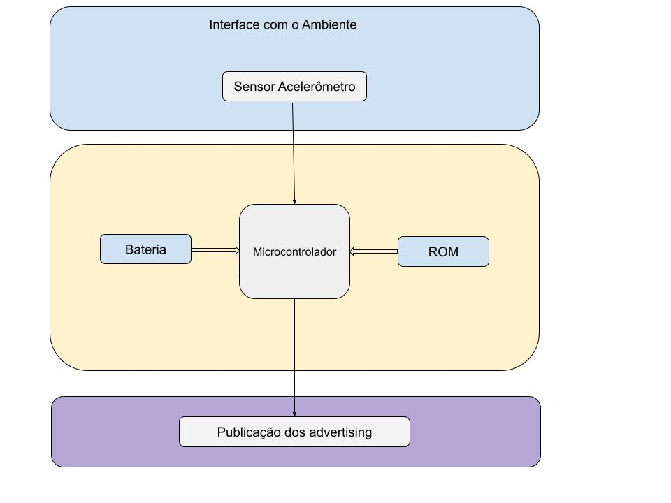

# `Sismógrafo com comunicação Bluetooth`
# `Seismograph with Bluetooth communication`

## Apresentação

O presente projeto foi originado no contexto das atividades da disciplina de graduação *EA075 - Sistemas Embarcados*, 
oferecida no primeiro semestre de 2023, na Unicamp, sob supervisão da Profa. Dra. Paula Dornhofer Paro Costa, do Departamento de Engenharia de Computação e Automação (DCA) da Faculdade de Engenharia Elétrica e de Computação (FEEC).

 |Nome  | RA | Curso|
 |--|--|--|
 | Rodrigo Dutra de Freitas Cardoso  | 205513  | Eng. Elétrica|
 | Vinicius de Lima Quadrado  | 225357  | Eng. Elétrica|

## Arquivos Importantes (:warning: NOVO :warning:)

>[Esquemático em PDF](link para imagens/pdf esquemático)
>
>[Lista de Componentes](link para components.md)
>
>[PCB](link para imagens/pdf PCB)

## Descrição do Projeto (:warning: ATUALIZAR :warning:)
> Deve refletir a última versão do projeto.
>
> Descrição do objetivo principal do projeto, incluindo contexto gerador, motivação.
> 
> Escreva essa seção imaginando que está tentando convencer alguém a investir financeiramente no seu projeto.
> 
> Qual problema vocês pretendem solucionar?
> 
> Quem são os potenciais usuários?
> 
> É possível estabelecer um valor econômico associado?
>
 Com o intuito de prever catastrofes naturais e assegurar que vidas possam ser poupadas, os alunos da Engenharia Elétrica da Unicamp, juntamente com os conhecimentos desenvolvidos na Disciplica de Sistemas Embarcados, desenvolveram um Sismógrafo com interface de comunicação Bluetooth.

 O projeto consiste em uma implementação de um Sensor Acelerômetro e um chip de BLE(Bluetooth Low Energy) para realizar aquisição de dados de vibração do solo, enviando para análise na nuvem e gerando relatórios em tempo real de ondas causadas por possíveis terremotos.

 O sistema completo que este projeto trata corresponde a um beacon sensor, responsável por detectar ondas sismicas, processar os dados recolhidos e emiti-los via advertisings BLE e também por um beacon receptor, que colhe os advertisings dos beacons sensores e os envia para a nuvem, no entanto **estamos limitando o escopo do projeto a apenas o beacon sensor**.

## Descrição Funcional (:warning: ATUALIZAR :warning:)
> Esta seção deve estar atualizada, refletindo o status do projeto no momento da entrega final (E3). 
> 
> Alterações realizadas no projeto entre a entrega E2 e a entrega E3 devem ser justificadas nas se, relatando claramente as dificuldades encontradas e as decisões > tomadas.

 Para aquisição dos dados de vibração do  solo será usado um sensor que mede as alterações de posição em relação ao local onde estiver instalado. Estas informações serão  enviadas via Bluetooth para uma central, onde serão analisadas e relatórios serão emitidos de acordo com a necessidade ou urgência de eventos serem informados para que medidas sejam tomadas.  

### Funcionalidades (ATUALIZAÇÃO NECESSÁRIA)
> Detalhe todas as tarefas que o sistema será capaz de executar

 - Beacon sensor
   - Tratar dados crus provenientes dos sensores
   - Emitir em advertisings BLE com os dados processados
 - Beacon receptor
   - Receber dados processados de diversos beacons sensores
   - Enviar dados para a nuvem.

### Configurabilidade (ATUALIZAÇÃO NECESSÁRIA)
> Detalhe, se houver, todas as possíveis configurações do circuito e todos os pontos de alteração da configuração.

 O usuáriuo poderá configurar os seguintes itens:
	- frequência com a qual será captadas as oscilações do solo
	- potência de comunicação via Bluetooth
 	- taxa de amostragem das oscilações

### Eventos

Os eventos tratados para o sistema serão:

1. Captura das ondas sísmicas
2. Filtragem e processamento dos sinais
3. Emissão dos advertisings contendo os dados tratados

Todos os eventos são periódicos, de frequência **F** a determinar em ensaios. Essa frequência deve ser tal que as frequências de onda mais comuns de eventos sísmicos possam ser detectadas precisamente.

### Tratamento de Eventos
 Para tratar os eventos vamos separar em três etapas:
	1 - propagação das ondas Sísmicas são captadas pelo sensor Acelerômetro
	2 - há um pré-tratamento dos dados, de forma que somente os dados considerados válidos serão guardados
	3 - envio dos dados para o beacon receptor 

## Especificações (:warning: ATUALIZAR :warning:)

### Estrutural (:warning: ATUALIZAR :warning:)
> (Se preferir, adicione um link para o documento de especificação estrutural)
> 
> Entende-se por estrutural a descrição tanto das características elétricas e temporais como das restrições físicas de cada bloco funcional.
> Nessa etapa do projeto, ainda não será solicitado o diagrama elétrico mas espera-se que já estejam identificados os componentes e circuitos integrados propostos
> para implementação do sistema embarcado proposto.
> 
> Como o projeto de um sistema embarcado é centralizado nas tarefas, recomenda-se iniciar com a definição dos periféricos de entrada e saída (atuadores e/ou sensores) apropriados para o
> sistema. Pode ser necessário definir um endereço distinto para cada um deles. 
> Este endereço será utilizado pela unidade micro-controladora para acessá-los tanto para leitura como para escrita.

> Nesta etapa do projeto espera-se que a unidade micro-controladora seja definida.
> Tendo definidos os periféricos e a memória, é possível projetar um decodificador de endereços
> que converte o endereço referenciado no programa em sinal *Chip Select – CS* do dispositivo
> correspondente, habilitando-o para realizar um ciclo de leitura ou de escrita.
> 
> Nesta etapa do projeto espera-se que sejam identificada também a eventual necessidade do projeto de circuitos de interface para os periféricos do projeto.
> Assim, devem ser incluídos na especificação, se necessário:
> - conversores AD e DA;
> - padrões de comunicação a serem adotados;
> - circuitos de sincronização de sinais temporais.
> 
> Finalmente, deve-se especificar as restrições físicas e ambientais de funcionamento do circuito, tais como limites mecânicos
> (altura, largura, profundidade) e limites de dissipação térmica.

## Microcontrolador
 Modelo: EFR32BG13P632F512GM32-D

 Datasheet: [EFR32BG13](./DataSheet/efr32bg13-datasheet.pdf)

 Este SoC faz parte da família de microcontroladores EFR32BG13, que possui  conectividade Bluetooth Low Energy (BLE) e são baseados na plataforma EFR32 da Silicon Labs. Ele foi projetado para fornecer recursos de comunicação sem fio de baixa energia para aplicações IoT (Internet of Things). 

 Características Elétricas:
  - Tensão de Alimentação: de  1,8 V a 3,8 V de uma fonte única. A ideia inicial é utilizar duas pilhas alcalinas tamanho AA em série, com tensão inicial de 3,2 volts. 
  - Correntes de Operação: A corrente de operação depende dos fatores abaixo:
    - Potência do rádio (Potência usada para emitir advertisings e realizar scans ativos). e frequência de emissão de advertisings.
      - 8.5 mA em TX a 0 dBm de potência em 2,4 GHz
      - 35.3 mA em Tx a 14 dBm de potência em 869 MHz. (Este MCU chega apenas até 10 dBM de potência de saída em rádio.
    - Uso da CPU para rodar o programa
      - 69 μA/MHz em Modo Ativo (EM0 - Energy Mode 0)
    - Modo Sleep:
      - 1.3 μA em EM2 (Energy Mode 2) DeepSleep (Retém 16 kB de RAM e roda RTCC a partir do LFRCO)
        - RTCC ->  Real Time Counter and Calendar
        - LFRCO -> Low-Frequency RC Oscillator
  - Possíveis Interfaces de Comunicação, a decisão é feita no firmware. 
    - Comuns:
      - UART - Universal Asynchronous Receiver/Transmitter
      - SPI - Serial Peripheral Interface
      - I2C - Inter-Integrated Circuit
    - Outras:
      - SmartCard (ISO 7816) - é um padrão internacional relacionado a cartões de identificação eletrônica com contatos,
      - IrDA - (Infrared Data Association)
      - I2S - Equivalente a I2C para sinais digitais de áudio.

 Características Temporais:
  - Taxa de Dados BLE: O módulo suporta uma taxa de dados especificada para comunicação Bluetooth Low Energy, geralmente na faixa de vários kilobits por segundo.
  - Taxa de amostragem do conversor AD: até 1 Msps (1M de amostras por segundo).
  - Taxa de entrada e saída de dados:
    - Bluetooth Low Energy: até 1 Mbps  
    - Interfaces seriais:
      - UART: depende do baudrate, normalmente 115200 bps (padrão) ou 115 Kbps
      - SPI: depende do uso atual das CPU’s e do tamanho da palavra
  - Latência: Cada ciclo de envio por rádio BLE, considerando transmissão nos 3 canais padrões do BLE: 37, 38 e 39; levam em torno de 4 ms para se completar.

 Restrições Físicas:
  - Tamanho e Layout de Pinos:
    - Empacotamento QFN32:
      - Dimensões: 5 x 5 x 0.75 mm
      - Pinos: 32 pinos
  - Configuração de Antenas: Antena tipo F invertida, construída na própria PCB (Printed Circuit Board). Detalhes serão exemplificados em uma sessão dedicada.

## Sensor Acelerômetro
 Modelo: ADXL345

 Datasheet: [ADXL345](./DataSheet/adxl345.pdf)

 O acelerômetro ADXL345 é um sensor de alta resolução e baixo consumo de energia projetado para medir acelerações em três eixos (x, y e z). Ele utiliza a tecnologia de microeletromecânica (MEMS) para detectar mudanças nas forças de aceleração e converter essas mudanças em um sinal elétrico proporcional.

 Características Elétricas:
  - Tensão de Alimentação: O acelerômetro ADXL345 opera com uma faixa de tensão especificada, geralmente entre 2.0V e 3.6V, garantindo uma alimentação adequada para seu funcionamento.
  - Corrente de Operação: É importante considerar a corrente típica de operação do acelerômetro para dimensionar corretamente a fonte de alimentação e garantir uma eficiência energética adequada.
    - consumo típico de corrente é de cerca de 40 microamperes (µA) a 2,5 volts de alimentação
  - Interface de Comunicação: O ADXL345 pode ser configurado para se comunicar por meio de uma interface digital, como I2C ou SPI, permitindo a integração com microcontroladores ou outros dispositivos em seu projeto.
 
 Características Temporais:
  - Faixa de Medição: O acelerômetro ADXL345 possui uma faixa de medição especificada para cada um dos três eixos (x, y e z), permitindo a detecção de acelerações em uma determinada escala, como ±2g, ±4g ou ±16g.
  - Resolução: É importante considerar a resolução do acelerômetro, que indica a menor mudança de aceleração que pode ser detectada. O ADXL345 possui uma resolução de 10 bits, o que proporciona uma precisão adequada para muitas aplicações.

 Restrições Físicas:
  - Tamanho e Layout de Pinos: 
    - Dimensões:
      - 3 x 5 x 1 mm
    - Pinos:
      - 14 pinos
  - Sensibilidade à Vibração: O acelerômetro é sensível a vibrações externas, portanto, considere medidas adequadas para minimizar interferências indesejadas, como o uso de isoladores mecânicos ou filtros adequados.

## Saída/Entrada de dados

 Teremos dois modos de I/O’s, cabeadas e sem fio.

 Cabeadas: 
  - Serão usadas as interfaces UART e SPI do microcontrolador

 Sem fio:

 Será utilizada uma antena F invertida,, construída na própria PCB do dispositivo, comumente conhecida por sua estrutura simples e eficiência de radiação, sendo frequentemente utilizada em aplicações de transmissão e recepção de sinais de rádio.

 Documentação Antena F Invertida:
 - [Design of 2.4 GHz-Band Meander Planar Inverted F Antenna for Bionic Hand Using DOE Method](https://ieeexplore.ieee.org/document/9501861)
 - [Inverted-F antenna](https://en.wikipedia.org/wiki/Inverted-F_antenna)

 Modelo: Antena F invertido

 Datasheet: [AN1088: Designing with an Inverted-F 2.4 GHz PCB Antenna](./DataSheet/an1088-designing-with-pcb-antenna.pdf)

 Características Elétricas:
  - Faixa de Frequência: A antena F invertida é projetada para operar em uma determinada faixa de frequência, que pode variar dependendo da aplicação específica. Neste caso, seguindo a normas do Bluetooth Core, a operação se dará em 2,4 Ghz.
  - Impedância Característica: A antena F invertida geralmente possui uma impedância característica específica, como 50 ohms, que deve ser compatível com o sistema de transmissão/recepção utilizado.
 
 Características Geométricas:
  - Sobre as dimensões da antena, o fabricante do microcontrolador recomenda seguir, vide datasheet, as seguintes especificações para a antena tipo F invertido
    - Para PCB FR4 de espessura 0,8mm e 0,062”, referência na imagem 2.1, página 3, do datasheet AN1088 da antena F invertido.

 Restrições de Projeto:
  - Espaço Disponível: A antena F invertida requer um espaço adequado para sua implementação. Certifique-se de reservar um espaço suficiente em sua placa de circuito impresso (PCB) ou em seu projeto para acomodar a antena de acordo com suas dimensões físicas.
  - Interferências Eletromagnéticas: A antena F invertida pode ser afetada por interferências eletromagnéticas próximas, como outros componentes eletrônicos ou objetos metálicos. Certifique-se de posicionar a antena longe de fontes potenciais de interferência para evitar distorções no desempenho.

### Algoritmos (:warning: ATUALIZAR :warning:)
 Para transformar um sinal de onda sísmica bruto em um dado entendível, você pode seguir uma sequência de etapas e aplicar os seguintes algoritmos:

 > (Se preferir, adicione um link para o documento de especificação de algoritmos).
> 
> Deve ser elaborado para CADA evento o algoritmo de tratamento deste evento. Com base no
> tamanho de cada algoritmo, estima-se o tamanho de memória necessária para armazenar todos
> os programas e os dados associados. Isso permitirá especificar a memória a ser utilizada e o
> espaço onde serão armazenados os programas. O algoritmo de tratamento de evento pode
> ser representado graficamente por um fluxograma. Recomenda-se usar símbolos gráficos consistentes 
> com a norma internacional ISO 1028-1973 e IS0 2972-1979.

1. Pré-processamento:
   - Filtro de banda: Aplicar um filtro de banda para remover ruídos indesejados e focar nas frequências de interesse.
   - Correção de amplitude: Corrigir possíveis variações na amplitude do sinal para garantir uma representação mais precisa.

2. Picking de fases:
   - Algoritmo de picking automático: Utilizar um algoritmo automático de picking de fases para identificar as chegadas das ondas sísmicas, como as ondas P e S. Isso pode ser baseado em técnicas de amplitude, polaridade ou outros critérios.

3. Cálculo de atributos sísmicos:
   - Envelope sísmico: Calcular o envelope do sinal para destacar as variações de amplitude e ajudar na interpretação visual.
   - Frequência central: Determinar a frequência central do sinal para identificar características importantes, como a resolução da imagem sísmica.

4. Inversão sísmica:
   - Inversão de impedância: Realizar uma inversão de impedância para estimar as propriedades físicas do subsolo, como a variação de impedância acústica. Isso ajuda a mapear as mudanças de litologia e identificar possíveis reservatórios de hidrocarbonetos.

Lembrando que a sequência e os algoritmos específicos podem variar dependendo dos objetivos da interpretação sísmica e das características dos dados. É sempre importante adaptar o fluxo de trabalho e escolher os algoritmos mais adequados para o contexto em que você está trabalhando.

## Descrição Estrutural do Sistema  (:warning: ATUALIZAR :warning:)
> Junto com a descrição do comportamento do sistema, deve-se especificar, em nível de bloco ou sistema, a estrutura necessária 
> para captar os eventos do mundo externo, para alojar e processar o programa de tratamento de eventos, e para atuar sobre o mundo externo.
>
> Para essa descrição recomenda-se a criação de diagramas de blocos.
> Nesse diagrama, devem ser destacados os blocos funcionais que compõem o sistema, incluindo uma síntese das funcionalidades de cada bloco.
> Além disso, deve-se esclarecer também o relacionamento entre estes blocos, incluindo os principais sinais de comunicação entre
> os blocos de forma a assegurar a execução de todas as tarefas que o sistema deve realizar.
Esq> 
> Você sabia? Ferramentas como o `draw.io` permitem integração com o Github.

## Referências
Decifrando a Terra. . São Paulo: Companhia Editora Nacional. . Acesso em: 02 abr. 2023. , 2009

Anthony, Robert & Ringler, Adam & Wilson, David & Wolin, Emily. (2018). Os sismógrafos de baixo custo funcionam bem o suficiente para a sua rede? Uma visão geral dos testes de laboratório e observações de campo do Raspberry Shake 4D da OSOP. Seismological Research Letters. 90. 10.1785/0220180251.
